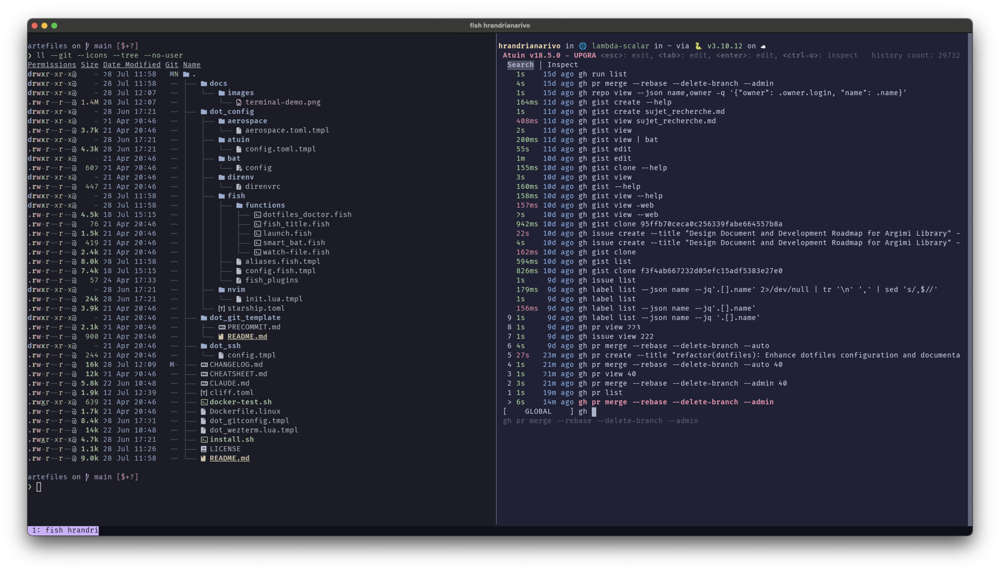

# Artefiles

A cross-platform dotfiles template that provides a **default and sane configuration for a modern development environment**. Managed with [chezmoi](https://chezmoi.io/), these dotfiles deliver a consistent, opinionated setup focused on productivity and modern tooling.

## Philosophy

This repository is designed to give you a **batteries-included development environment** that:
- Uses **WezTerm** as the terminal emulator for its GPU acceleration and modern features
- Uses **Fish Shell** for intelligent autosuggestions and superior user experience
- Leverages **modern Rust-based Unix tools** (eza, bat, fd, rg) for better performance and UX
- Provides consistent configuration across macOS and Linux platforms


*Modern terminal setup with Fish shell, Starship prompt, and Rust-based tools*

## Quick Start 🚀

### macOS Prerequisites

⚠️ **Important for macOS users:** Before installing these dotfiles, you must first:

1. Install [Homebrew](https://brew.sh/) by running:
   ```bash
   /bin/bash -c "$(curl -fsSL https://raw.githubusercontent.com/Homebrew/install/HEAD/install.sh)"
   ```

2. Install GitHub CLI using Homebrew:
   ```bash
   brew install gh
   ```

3. Authenticate with GitHub:
   ```bash
   gh auth login
   ```

These steps are essential as the dotfiles rely heavily on Homebrew for package management on macOS.

### Installation

#### Using Bash/Zsh/Sh

```bash
sh -c "$(curl -fsLS get.chezmoi.io)" -- -b $HOME/.local/bin init --apply artefactory/artefiles
```

#### Using Fish Shell

```fish
curl -fsLS get.chezmoi.io | sh -s -- -b ~/.local/bin init --apply artefactory/artefiles # Fish shell requires this pipe syntax
```

### GitHub Codespaces Support

These dotfiles can automatically bootstrap your GitHub Codespace environment. To use them:

1. Add this repository as your dotfiles in your [GitHub Codespaces settings](https://github.com/settings/codespaces)
2. Create a new codespace - it will automatically apply these dotfiles

Learn more about Codespaces dotfiles in the [official documentation](https://docs.github.com/en/codespaces/customizing-your-codespace/personalizing-github-codespaces-for-your-account#dotfiles).

## What's Included 📦

### Core Features

- 🐟 **[Fish Shell](https://fishshell.com/)** - A smart command-line shell that suggests commands as you type and has better tab completion than traditional shells
- ⚡ **[Starship](https://starship.rs/)** - A customizable terminal prompt that shows useful information like git status, programming language versions, and execution time
- 📝 **[Neovim](https://neovim.io/)** - A powerful text editor for coding with syntax highlighting, plugins, and modern features
- 🔍 **Modern CLI Tools** - Faster, more user-friendly replacements for traditional Unix commands:
  - `bat` - Enhanced version of `cat` with syntax highlighting and line numbers
  - `eza` - Better `ls` with colors, git status, and tree view
  - `fd` - Faster, easier-to-use alternative to `find` for searching files
  - `fzf` - Fuzzy finder for quickly searching through files and command history
  - `ripgrep` - Lightning-fast text search across files
- 🌟 **[Catppuccin](https://github.com/catppuccin/catppuccin)** - A beautiful, consistent color theme applied across all tools for a cohesive look

### Development Tools

- 🐍 **Python Environment Management** - Tools to manage Python projects and dependencies:
  - **[uv](https://github.com/astral-sh/uv)** - Ultra-fast Python package installer and resolver
  - **[direnv](https://direnv.net/)** - Automatically loads project-specific environment variables when you enter a directory
- 🔄 **Git Configuration** - Pre-configured version control settings with modern defaults and helpful aliases
  - 🤖 **GitHub Copilot CLI** - AI-powered command suggestions and explanations
- 📊 **Jupyter Notebook Support** - Enhanced tools for working with data science notebooks
- 🐋 **Container Development** - [Colima](https://github.com/abiosoft/colima) for running Docker containers on macOS without Docker Desktop
- ⏰ **Shell History** - [Atuin](https://atuin.sh/) syncs your command history across machines with powerful search
- 📁 **Smart Navigation** - [Zoxide](https://github.com/ajeetdsouza/zoxide) learns your most-used directories for instant navigation

## What Files Will Be Created/Modified 📋

⚠️ **Important**: These dotfiles do NOT modify your shell startup files (.profile, .zprofile, etc.). To benefit from the Fish shell configuration, you must manually change your default shell (see [Post-Installation Steps](#post-installation-steps-📝)).

### Git Configuration
- `~/.gitconfig` - Git configuration with modern defaults ([Git Documentation](https://git-scm.com/docs/git-config))

### Terminal Configuration
- `~/.wezterm.lua` - WezTerm terminal configuration ([WezTerm Documentation](https://wezfurlong.org/wezterm/))

### Fish Shell Configuration ([Fish Shell Documentation](https://fishshell.com/docs/current/))
- `~/.config/fish/config.fish` - Main Fish shell configuration
- `~/.config/fish/aliases.fish` - Shell aliases and functions
- `~/.config/fish/fish_plugins` - Fish plugin list
- `~/.config/fish/functions/fish_title.fish` - Terminal title function
- `~/.config/fish/functions/smart_bat.fish` - Enhanced bat function (VSCode-aware)
- `~/.config/fish/functions/launch.fish` - Application launcher
- `~/.config/fish/functions/watch-file.fish` - File watching function
- `~/.config/fish/functions/dotfiles_doctor.fish` - Health check function

### Shell Prompt
- `~/.config/starship.toml` - Shell prompt configuration ([Starship Documentation](https://starship.rs/))

### Development Tools
- `~/.config/bat/config` - Syntax highlighter configuration ([Bat Documentation](https://github.com/sharkdp/bat))
- `~/.config/direnv/direnvrc` - Environment management ([Direnv Documentation](https://direnv.net/))
- `~/.config/atuin/config.toml` - Shell history sync ([Atuin Documentation](https://atuin.sh/))
- `~/.config/nvim/init.lua` - Neovim editor configuration ([Neovim Documentation](https://neovim.io/doc/))

### macOS Window Manager
- `~/.config/aerospace/aerospace.toml` - AeroSpace window manager ([AeroSpace Documentation](https://nikitabobko.github.io/AeroSpace/)) (macOS only)

## Prerequisites ✅

### For All Platforms
- A GitHub account (for git and GitHub-related features)
  - GitHub CLI authentication will be handled automatically during installation
  - For non-interactive environments, set `GH_TOKEN` environment variable before installation
- SSH keys added to your GitHub account ([instructions](https://docs.github.com/en/authentication/connecting-to-github-with-ssh/generating-a-new-ssh-key-and-adding-it-to-the-ssh-agent))

### macOS Specific
- [Homebrew](https://brew.sh/) package manager (see [macOS Prerequisites](#macos-prerequisites) above)
- GitHub CLI installed via Homebrew
- Note: Many tools in these dotfiles depend on Homebrew-installed packages on macOS

## Common Tasks 🛠️

| Task | Command |
|------|---------|
| Update dotfiles | `chezmoi update` |
| Edit config | `chezmoi edit ~/.config/file` |
| Health check | `dotfiles_doctor` |
| New Python project | `mkdir project && cd project && echo 'layout uv' > .envrc && direnv allow` |

## Configuration Structure 📁

```
~/.config/
  ├── fish/            # Shell configuration
  │   ├── config.fish  # Main shell configuration
  │   ├── aliases.fish # Shell aliases and functions
  │   └── functions/   # Custom fish functions
  ├── nvim/            # Editor configuration
  ├── direnv/          # Environment management
  ├── bat/             # Syntax highlighting
  └── starship.toml    # Prompt configuration

~/.ssh/config          # SSH configuration
~/.wezterm.lua        # Terminal configuration
~/.gitconfig          # Git configuration
```

## Post-Installation Steps 📝

### 1. Change Default Shell to Fish (Required for Full Experience)

⚠️ **Important**: To benefit from the Fish shell configuration, you must manually change your default shell:

**macOS:**
```bash
chsh -s $(brew --prefix)/bin/fish
```

**Linux:**
```bash
chsh -s $(which fish)
```

*Note: You may need to log out and back in for the shell change to take effect.*

### 2. Set up shell history sync:
```bash
atuin register  # New account
atuin login     # Existing account
```

### 3. Initialize cloud tools (if needed):
```bash
gcloud init  # Set up Google Cloud SDK
```

## Need Help? 🤔

- Run `dotfiles_doctor` to check your installation
- See `chezmoi help` for dotfiles management
- Check the [CHEATSHEET.md](CHEATSHEET.md) for more commands
- Reset a file: `chezmoi apply --force ~/.path/to/file`

## Detailed Documentation 📚

- [CHEATSHEET.md](CHEATSHEET.md) - Common commands and shortcuts
- [CHANGELOG.md](CHANGELOG.md) - Version history and updates

## License 📄

MIT
